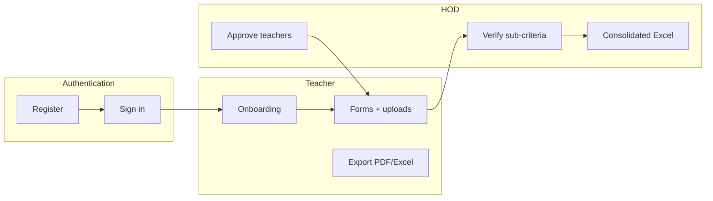

# NAAC File Management System

A web portal for **department-level NAAC (National Assessment and Accreditation Council) documentation**. Colleges preparing for accreditation must collect structured evidence across seven criteria and many sub-criteria. This system replaces scattered spreadsheets and email threads with one place where teachers submit data, HODs verify it, and the department exports submission-ready packs.

Built as a **hackathon project** using Next.js, MongoDB, and Cloudinary.

---

## Problem we solve

| Challenge | How this app helps |
|-----------|-------------------|
| Evidence spread across emails and drives | Central forms + cloud file storage per sub-criterion |
| No visibility on who finished what | Teacher dashboards and HOD department overview with progress % |
| Manual Excel/PDF assembly | One-click teacher PDF/Excel and HOD consolidated workbook |
| Weak audit trail | Activity log, verification status, and in-app notifications |

---

## Features

### For teachers

- **Dashboard** — overall completion %, per-criterion progress, pending items, notifications
- **Onboarding** — department and subjects after first sign-in
- **Criterion workspaces** — navigate C1–C7 and each sub-criterion
- **Dynamic forms** — guided fields with autosave
- **Evidence uploads** — PDF, DOCX, JPG, PNG via Cloudinary (signed uploads)
- **My Files** — view uploaded evidence
- **Exports** — download personal NAAC pack as **PDF** or **Excel**
- **Log out** — from sidebar or top bar

### For HOD (Head of Department)

- **Department dashboard** — teacher count, average progress, submission funnel, per-criterion bars
- **Teacher management** — approve pending registrations, view profiles, deactivate accounts
- **Sub-criterion verification** — mark each submission **Verified** or **Needs revision**
- **Reminders** — notify teachers about pending work
- **Activity log** — audit trail of important actions
- **Consolidated export** — department Excel (summary + C1–C7 sheets + document index)
- **Log out** — from sidebar or top bar

### NAAC scope

The catalog in `lib/naac/catalog.ts` aligns with the project guide:

| Code | Criterion | Max marks |
|------|-----------|-----------|
| C1 | Curriculum Aspects | 100 |
| C2 | Teaching-Learning & Evaluation | 350 |
| C3 | Research, Innovations & Extension | 110 |
| C4 | Infrastructure & Learning Resources | 100 |
| C5 | Student Support & Progression | 140 |
| C6 | Governance, Leadership & Management | 100 |
| C7 | Institutional Values & Best Practices | 100 |

The portal covers **24 sub-criteria** in total (e.g. C1.1, C2.3), each with dedicated forms and upload slots.

---

## Tech stack

| Layer | Technology |
|-------|------------|
| Framework | [Next.js 16](https://nextjs.org/) (App Router) |
| UI | React 19, Tailwind CSS 4, Lucide icons |
| Auth | NextAuth.js (credentials, JWT sessions) |
| Database | MongoDB with Mongoose |
| File storage | Cloudinary |
| Exports | ExcelJS, `@react-pdf/renderer` |
| Charts | Recharts |
| Validation | Zod |

---

## Project structure

```
web/
├── app/                    # Pages & API routes (App Router)
│   ├── auth/               # Sign in, register
│   ├── teacher/            # Teacher dashboard, criteria, files
│   ├── hod/                # HOD dashboard, teachers, audit
│   ├── onboarding/         # Profile setup after registration
│   └── api/                # REST handlers (submissions, exports, HOD tools)
├── components/
│   ├── portal/             # Shell, sidebar, top bar
│   └── naac/               # Forms, evidence, progress UI
├── lib/
│   ├── naac/               # Criteria & sub-criteria catalog
│   ├── forms/              # Form definitions, progress logic
│   ├── auth/               # NextAuth config, API guards
│   ├── export/             # PDF/Excel builders
│   ├── hod/                # Department statistics
│   └── models/             # Mongoose schemas
└── samples/exports/        # Optional demo PDF/Excel for judges
```

Repository root contains `web/` (the application) and editor settings under `.vscode/`.

---

## Roles & workflow



1. **HOD registers** at `/auth/register` with role *HOD* and the `HOD_INVITE_CODE` from environment variables.
2. **Teachers register** — accounts start as `PENDING` until the HOD approves them under **HOD → Users**.
3. **Teachers sign in**, complete **onboarding** (department + subjects), then work through **C1–C7** forms and evidence.
4. **HOD** reviews submissions, sends reminders, checks the **audit log**, and downloads the **consolidated Excel**.

---

## Getting started

### Prerequisites

- **Node.js 20+**
- **MongoDB** (Atlas or local)
- **Cloudinary** account (for evidence uploads)
- Optional: `openssl` to generate `NEXTAUTH_SECRET`

### Environment variables

Copy `.env.example` to `.env.local` and fill in:

| Variable | Purpose |
|----------|---------|
| `MONGODB_URI` | MongoDB connection string |
| `NEXTAUTH_SECRET` | Random secret (`openssl rand -base64 32`) |
| `NEXTAUTH_URL` | App URL, e.g. `http://localhost:3000` |
| `CLOUDINARY_CLOUD_NAME` | Cloudinary cloud name |
| `CLOUDINARY_API_KEY` | Cloudinary API key |
| `CLOUDINARY_API_SECRET` | Cloudinary API secret |
| `HOD_INVITE_CODE` | Secret required to register a HOD account |
| `NEXT_PUBLIC_APP_URL` | Optional public URL for absolute links |
| `NEXT_PUBLIC_PORTAL_DEPARTMENT` | Optional label shown in the sidebar |

### Install and run

```bash
cd web
npm install
npm run dev
```

Open [http://localhost:3000](http://localhost:3000).

**Tips**

- Set `NEXTAUTH_URL` to the **exact** origin you use (`http://localhost:3000` vs `http://127.0.0.1:3000`).
- If sign-in fails after registration, restart `npm run dev` (native `bcrypt` must load correctly).

### NPM scripts

| Command | Description |
|---------|-------------|
| `npm run dev` | Start development server |
| `npm run build` | Production build |
| `npm start` | Run production server |
| `npm run lint` | Run ESLint |

---

## Key routes

| Area | Path |
|------|------|
| Home | `/` |
| Sign in | `/auth/sign-in` |
| Register | `/auth/register` |
| Teacher dashboard | `/teacher` |
| Criterion hub | `/teacher/criteria/C1` … `C7` |
| Sub-criterion editor | `/teacher/criteria/C1/C1.1` (example) |
| Teacher files | `/teacher/files` |
| HOD dashboard | `/hod` |
| HOD users | `/hod/teachers` |
| HOD audit | `/hod/audit` |
| Teacher PDF export | `GET /api/export/teacher/pdf` |
| Teacher Excel export | `GET /api/export/teacher/excel` |
| HOD consolidated Excel | `GET /api/hod/export/consolidated` |

Protected routes require sign-in. Workspaces redirect unauthenticated users to `/auth/sign-in`.

---

## Database (MongoDB)

Models live in `lib/models/`:

| Model | Purpose |
|-------|---------|
| `User` | Auth (`passwordHash`), profile, role (`TEACHER` \| `HOD`), `approvalStatus`, `isActive` |
| `SubCriterionSubmission` | Form answers per user + sub-criterion |
| `EvidenceFile` | Cloudinary metadata linked to sub-criterion |
| `SubCriterionVerification` | HOD status per teacher + sub-criterion |
| `Notification` | In-app messages and reminders |
| `ActivityLog` | Audit trail entries |

---

## Sample exports (optional)

For demos or judging, generate exports from a running instance and place files under `samples/exports/`:

- Teacher PDF — `/api/export/teacher/pdf`
- Teacher Excel — `/api/export/teacher/excel`
- HOD consolidated workbook — `/api/hod/export/consolidated`

See `samples/exports/README.txt` for details. These files are not committed by default.

---

## Deployment

Suitable for [Vercel](https://vercel.com/) or similar Node hosts:

1. Set all environment variables in the hosting dashboard.
2. Set `NEXTAUTH_URL` to your production domain.
3. Allow MongoDB Atlas network access from your host (or restrict by IP in production).
4. Run `npm run build` and deploy the `web` app root.

---

## License & context

Hackathon / academic project for departmental NAAC documentation. Extend the criteria catalog, form definitions, and export templates in `lib/` as your institution’s guide requires.
